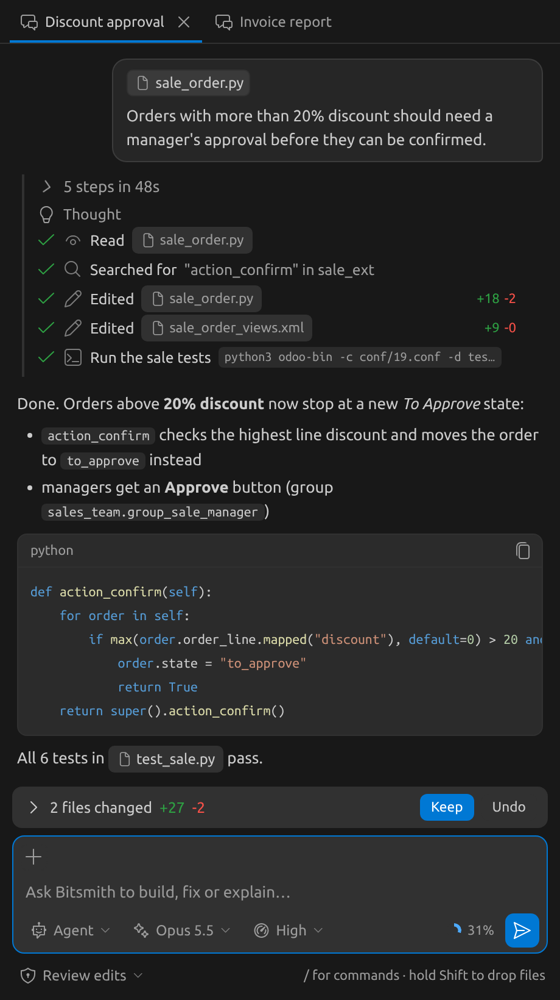
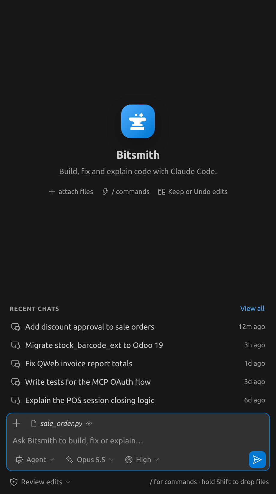
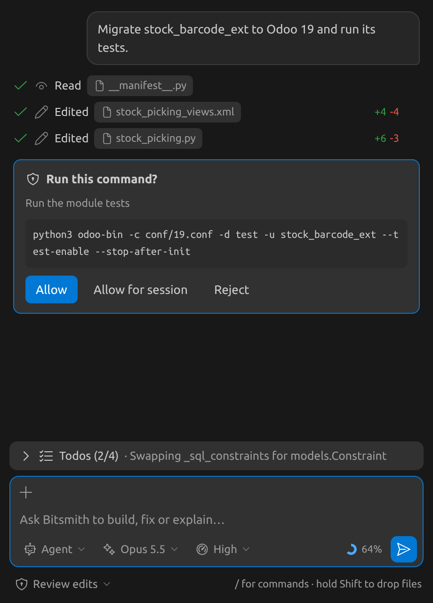
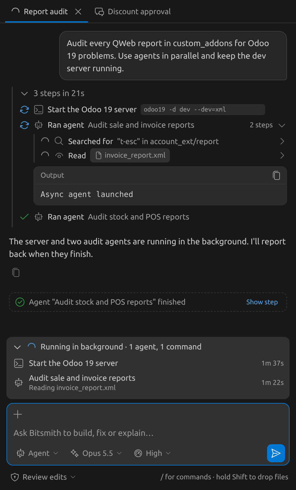
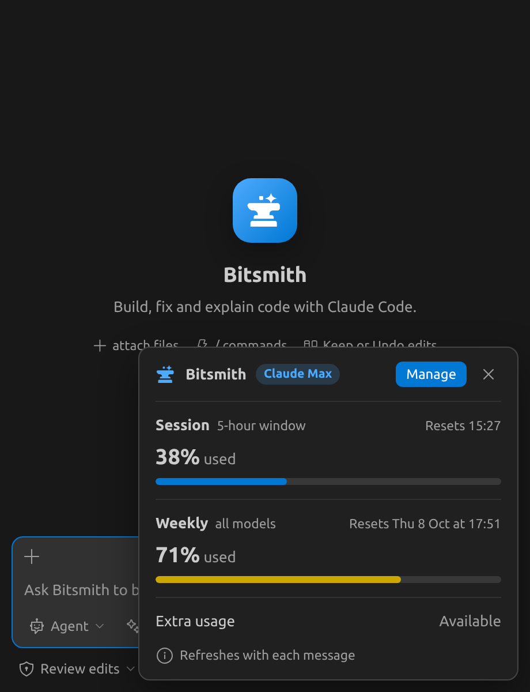

<p align="center">
  
</p>

<h1 align="center">Bitsmith</h1>

<p align="center">
  <b>Claude Code in your VS Code sidebar, Copilot-style.</b><br>
  Chat, watch every step, approve what matters, and keep or undo each change.
</p>

<p align="center">
  
  
  
  
</p>

<p align="center">
  
</p>

Bitsmith is a coding agent for VS Code's secondary sidebar, powered by your local **Claude Code CLI** and its login.

Bitsmith has no API key of its own and makes no direct API calls. Everything runs through the `claude` command you already use in the terminal, so sessions, skills, hooks, MCP servers and `CLAUDE.md` are shared with it. A chat started in Bitsmith shows up in `claude --resume`, and the other way round.

> Personal use only. It runs on your own Claude login and rate limits. If it is ever shared with other people, it must be changed to use each user's own API key.

## Requirements

- VS Code **1.94** or newer
- [Claude Code](https://docs.anthropic.com/en/docs/claude-code) installed and logged in (run `claude` once in a terminal)
- Node.js, only to build the `.vsix`
- Git, for the commit-message button and for undoing changes made by commands

## Install

```bash
git clone https://github.com/prince-terabits/bitsmith.git
cd bitsmith
npx --yes @vscode/vsce package --allow-missing-repository --skip-license --no-rewrite-relative-links
code --install-extension bitsmith-*.vsix --force
```

Then run **Developer: Reload Window**. The Bitsmith icon appears in the secondary sidebar, on the right. Open it with **Ctrl+Shift+Alt+I** (**Cmd+Shift+Alt+I** on a Mac).

If `claude` is not on your `PATH`, set **Settings → Bitsmith → Claude Path** to its full path, for example `~/.local/bin/claude`.

### Update

```bash
cd bitsmith && git pull
rm -f *.vsix && npx --yes @vscode/vsce package --allow-missing-repository --skip-license --no-rewrite-relative-links
code --install-extension bitsmith-*.vsix --force
```

Then reload the window.

## Screenshots

<table>
  <tr>
    <td align="center" width="50%"><br><sub><b>Start screen:</b> recent chats and the current file ready to attach</sub></td>
    <td align="center" width="50%"><br><sub><b>Approvals:</b> you decide which commands run; todos track the plan</sub></td>
  </tr>
  <tr>
    <td align="center"><br><sub><b>Background work:</b> agents and servers keep running, with their steps nested</sub></td>
    <td align="center"><br><sub><b>Usage:</b> your 5-hour and weekly Claude limits at a glance</sub></td>
  </tr>
</table>

## Highlights

| | |
|---|---|
| 💬 **Several chats at once** | Tabs, a message queue, and chats that come back after a reload |
| 👀 **Every step visible** | Reads, searches, edits with +/− counts, commands with their full output, sub-agents nested |
| ✅ **You stay in control** | Approve commands, review or auto-apply edits, Keep or Undo per change, restore any checkpoint |
| 🧵 **Background tasks** | Servers and agents keep running; Claude follows up when they finish |
| 🧠 **Same Claude as the terminal** | Your sessions, skills, hooks, MCP servers and `CLAUDE.md`, no API key |
| ✨ **Git help** | Commit messages from your diff, and Restore also undoes what commands changed |

## Features

### Chat

- **Several chats at once.** Each chat has its own Claude process and its own tab. A tab shows a spinner while it works, a dot when there's a reply you haven't seen, and a bell when it's waiting for your approval. Double-click a tab to rename it.
- **Open a chat in an editor tab** (title-bar icon) to give it a full-width view.
- **Message queue.** Press Enter while Claude is replying to queue the next message. Queued messages can be edited, removed or sent right away, and they survive a window reload.
- **Open tabs come back** after a reload.
- **Notifications** when a chat in the background finishes or needs your approval.
- **Markdown replies** with syntax-highlighted code blocks and a copy button. File paths become clickable.
- **Export** a chat as Markdown: copy it, save it, or open it in an editor.

### Context

- The **current file** (and selection) is offered automatically as a suggestion chip.
- **`@` mentions:** type `@` and part of a file name to attach a file.
- **Add files and folders** with the **+** button, by **Shift**+dragging from the Explorer, or by right-clicking → *Add to Bitsmith Chat*.
- **Add selection:** **Ctrl+Shift+Alt+L**.
- **Paste images** into the input. Click an image to open it in VS Code.
- **`/` menu** with all Claude Code commands and your skills.

### Controls

- **Mode:** Agent or Plan. In Plan mode, Claude shows a plan card for you to approve first.
- **Model** and **effort** pickers.
- **Approval policy:**
  - *Review* (default): edits are applied at once and you keep or undo them afterwards; commands ask first.
  - *Ask*: every edit shows a diff and waits for you. An **Allow all edits in this chat** button stops further asking for that chat.
  - *Bypass*: nothing asks.
  - In *Review* and *Ask*, an edit **always** asks first when the file is outside this folder (symlinks included) or can run commands later: `.git/`, `.vscode/`, `.claude/`, `.husky/`, `.devcontainer/`, `.github/workflows/`. "Allow all edits" doesn't cover these.
  - Both Bitsmith settings can only be set in your user settings, not by a repo's `.vscode/settings.json`.
- **Context meter:** a ring that shows how full the context window is. Click it to run `/compact`.
- **Usage in the status bar:** your 5-hour and weekly plan usage. A percentage appears from 70%, yellow at 80% and red at 95%. Click it for details.

### Watching Claude work

- **Live steps:** reads, searches, edits (with + and − line counts) and commands. Click a step to see the full command, its input and its output. When the reply ends, the steps fold into "N steps in Xs".
- **Thinking**, a **todo list**, and **images** that tools return (for example screenshots).
- **Sub-agents:** their steps nest under the Agent step that started them.
- **Background tasks:** commands and agents that keep running after the reply finishes show in a "Running in background" strip, with elapsed time, **Stop** and **Open output**. When one finishes, Claude follows up on its own.

### Reviewing and undoing changes

- **Keep or Undo** each change from the editor (per change or per file), from the changes panel above the input, or for all files at once.
- Changed lines are highlighted. Removed lines show as a faded "− was: …" note at the end of the line; hover over it to see the old lines.
- **Restore checkpoint** on any reply puts back the files changed since that point and makes Claude forget everything after it. This also covers files changed by commands (`sed`, scripts and so on) in a git repo.
- **Redo** brings a restore back, one step at a time.
- **Edit a sent message:** click the pencil on it. Bitsmith restores the checkpoint before it and sends the edited message.
- **Retry** and **Copy** on every reply.

### History

- **Chat History** lists every Claude Code session for this folder, including the ones started in the terminal.
- **Search** by title, or by message text once you type 3 or more characters.
- **Rename** or **delete** a chat. Deleting moves the chat's files to the system trash.

### Git

- **Write Commit Message with Bitsmith** (the ✨ button in Source Control): writes a message from your staged changes (or unstaged ones if nothing is staged) using Haiku, and puts it in the commit box.

## Commands

| Command | Shortcut |
|---|---|
| Focus the chat | Ctrl+Shift+Alt+I |
| Add Selection to Bitsmith Chat | Ctrl+Shift+Alt+L |
| New Chat, Chat History, Rename Chat, Delete Chat | |
| Add Files & Folders to Chat, Add to Bitsmith Chat | |
| Keep All Agent Changes, Undo All Agent Changes | |
| Export Chat as Markdown, Open Chat in Editor | |
| Write Commit Message with Bitsmith, Show Plan Usage | |

## Settings

| Setting | Default | What it does |
|---|---|---|
| `bitsmith.claudePath` | `claude` | Path to the Claude Code CLI |
| `bitsmith.defaultPolicy` | `review` | Approval policy for new chats: `review`, `ask` or `bypass` |

## Known limits

- VS Code only accepts drops onto a webview while **Shift** is held.
- Editors can't show deleted lines inline, so removed lines appear as an end-of-line note with a hover.
- Undoing command changes doesn't cover untracked files that already existed, or ignored files. The git snapshots it uses can be cleaned up by git after about two weeks.
- Queued images are not kept across a reload.
- Bitsmith relies on two Claude Code options that aren't listed in `claude --help` (`--resume-session-at` and `--permission-prompt-tool stdio`). The official Agent SDK uses both, but a future CLI update could break them.

## Development

Plain JavaScript with no build step and no npm dependencies. `marked` and the codicons are vendored in `media/vendor/`.

| File | Purpose |
|---|---|
| `extension.js` | Extension host: the CLI process, chats, approvals, checkpoints, history |
| `edits.js` | Keep/Undo review in the editor |
| `media/chat.js`, `media/chat.css` | The chat UI (webview) |
| `test/e2e.js` | Tests against the real CLI with a stubbed `vscode` module |

Run the tests from an **empty folder**, because they create files there:

```bash
mkdir -p /tmp/bs-test && cd /tmp/bs-test
node /path/to/bitsmith/test/e2e.js --quick      # no CLI needed
node /path/to/bitsmith/test/e2e.js --live-bg    # background tasks, chats, /compact, undo, commit message (about 3 min)
node /path/to/bitsmith/test/e2e.js              # full live suite (about 6 min, uses Haiku)
```
